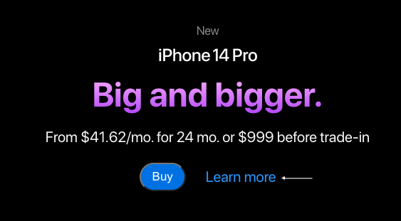
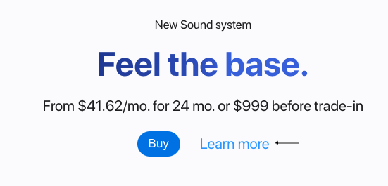
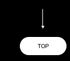
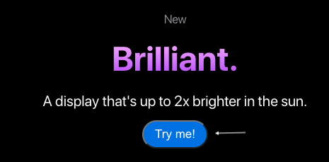

<h1 align="center">Welcome to iPhone-3D-animation-website 👋</h1>
<p>
  
  <a href="https://twitter.com/RoDavidovich" target="_blank">
    
  </a>
</p>

> This is a test project about creating a 3D animation in React, using technologies such as WebGi (powered by Three.js) and GSAP. Also, this is an effort to learn how to optimize 3D animations in React for mobile devices.

### 🏠 [Homepage](iphoneanimation.tech)

### ✨ [Demo](iphoneanimation.tech)


## Install

```sh
npm install
```

## Usage

```sh
npm run dev
```

> Use "Learn more" and "Top" buttons to check exciting transition animation iPhone model between different website sections.






> "Try me!" button gives you access to advanced animation mode where you can interact with the model using mouse.



## Author

👤 **Roman Davidovich**

- Twitter: [@RoDavidovich](https://twitter.com/RoDavidovich)
- Github: [@raman-davidovich](https://github.com/raman-davidovich)
- LinkedIn: [@raman-davidovich](https://linkedin.com/in/raman-davidovich)

## Show your support

Give a ⭐️ if this project helped you!

---

_This README was generated with ❤️ by [readme-md-generator](https://github.com/kefranabg/readme-md-generator)_
